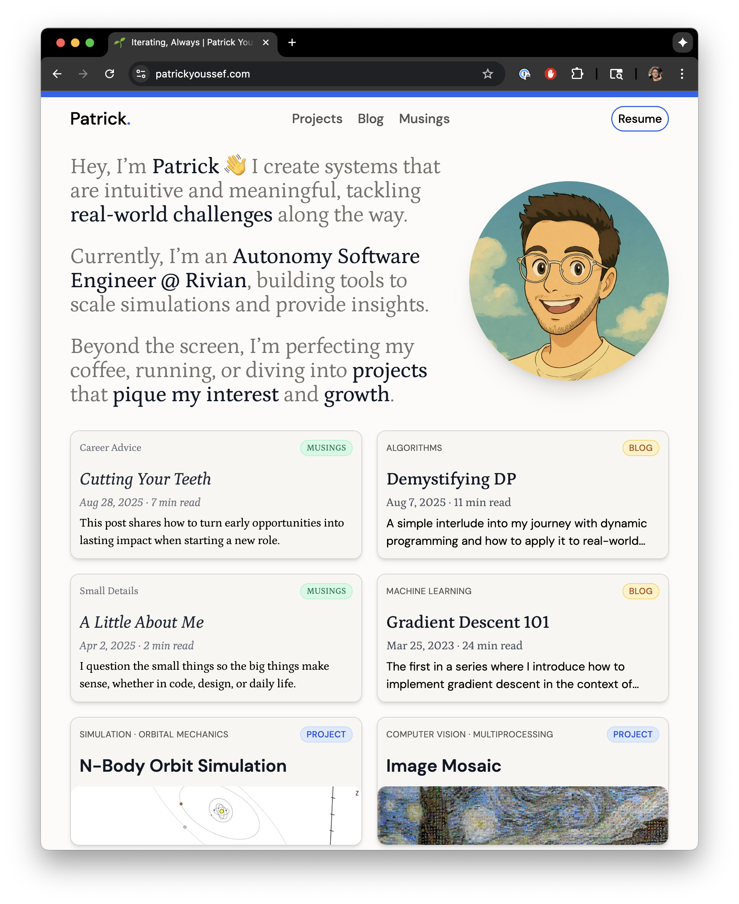

# PatrickYoussef.com

A personal website showcasing technical projects, engineering insights, and thoughtful reflections. Built with modern web technologies to be fast, accessible, and maintainable.



## Build Status

[](https://app.netlify.com/projects/loquacious-snickerdoodle-c04dc5/deploys)

## 🎯 Purpose

This site serves as both a professional portfolio and personal space, featuring:

- **Projects** - Technical work and engineering solutions
- **Blog** - Deep dives into technology, development practices, and lessons learned
- **Musings** - Reflective writing and distilled thoughts on growth, uncertainty, and meaningful work

## 🏗️ Architecture

Built with [Astro](https://astro.build/) for optimal performance and developer experience:

- **Framework**: Astro 5.x with TypeScript
- **Styling**: Tailwind CSS with custom design system
- **Content**: MDX for rich content with embedded components
- **Deployment**: Optimized static site generation

## 📁 Project Structure

```text
PersonalWebsiteV2/
├── public/                  # Static assets
├── src/
│   ├── components/         # Reusable UI components
│   │   ├── Cards/         # Content card components
│   │   ├── Header/        # Navigation and site header
│   │   ├── Layout/        # Layout utilities and grids
│   │   └── Sections/      # Page sections
│   ├── content/           # Content collections
│   │   ├── blog/          # Technical blog posts
│   │   ├── musings/       # Reflective writing
│   │   ├── projects/      # Portfolio projects
│   │   └── supplements/   # Site copy and assets
│   ├── layouts/           # Page layouts
│   ├── pages/             # Route definitions
│   ├── styles/            # Global styles
│   └── utils/             # Helper functions
├── build_utils/           # Build-time utilities
└── dist/                  # Generated static site
```

## 🚀 Development

### Prerequisites

- [Node.js](https://nodejs.org/) (18+)
- [pnpm](https://pnpm.io/) (recommended package manager)

### Getting Started

```bash
# Install dependencies
pnpm install

# Start development server
pnpm dev

# Build for production
pnpm build

# Preview production build
pnpm preview
```

### Available Commands

| Command                | Action                                     |
| :--------------------- | :----------------------------------------- |
| `pnpm dev`             | Start local dev server at `localhost:4321` |
| `pnpm build`           | Build production site to `./dist/`         |
| `pnpm preview`         | Preview build locally before deploying     |
| `pnpm lint`            | Run ESLint on codebase                     |
| `pnpm lint:fix`        | Fix auto-fixable linting issues            |
| `pnpm format`          | Format code with Prettier                  |
| `pnpm format:check`    | Check code formatting                      |
| `pnpm optimize-images` | Optimize and crop feature images           |

## 🎨 Design Philosophy

- **Performance First**: Static generation with minimal JavaScript
- **Accessibility**: Semantic HTML and WCAG compliance
- **Typography**: Thoughtful type scale and reading experience
- **Responsive**: Mobile-first design with fluid layouts
- **Maintainable**: Component-driven architecture with clear separation of concerns

## 🔧 Key Features

- **Content Collections**: Type-safe content management with Astro collections
- **MDX Support**: Rich content with embedded components
- **Math Rendering**: KaTeX integration for mathematical expressions
- **Code Highlighting**: Syntax highlighting with Shiki
- **Reading Time**: Automatic reading time calculations
- **SEO Optimized**: Meta tags, structured data, and performance optimization
- **Dark Mode Ready**: Prepared for light/dark theme switching

## 📝 Content Guidelines

### Blog Posts

Technical content focusing on engineering insights, development practices, and lessons learned from real-world projects.

### Projects

Portfolio pieces showcasing technical skills, problem-solving approaches, and meaningful impact.

### Musings

Reflective writing on professional growth, navigating uncertainty, and finding meaning in technical work.

## 🚦 Performance

Optimized for Core Web Vitals:

- Minimal JavaScript bundle
- Optimized images with modern formats
- Efficient CSS with Tailwind's JIT compilation
- Static generation for fast initial loads

## 📄 License

This project is for personal use. Content and code structure may be referenced for learning purposes.

---

Built with care by [Patrick Youssef](https://patrickyoussef.com) • Iterating, Always.
