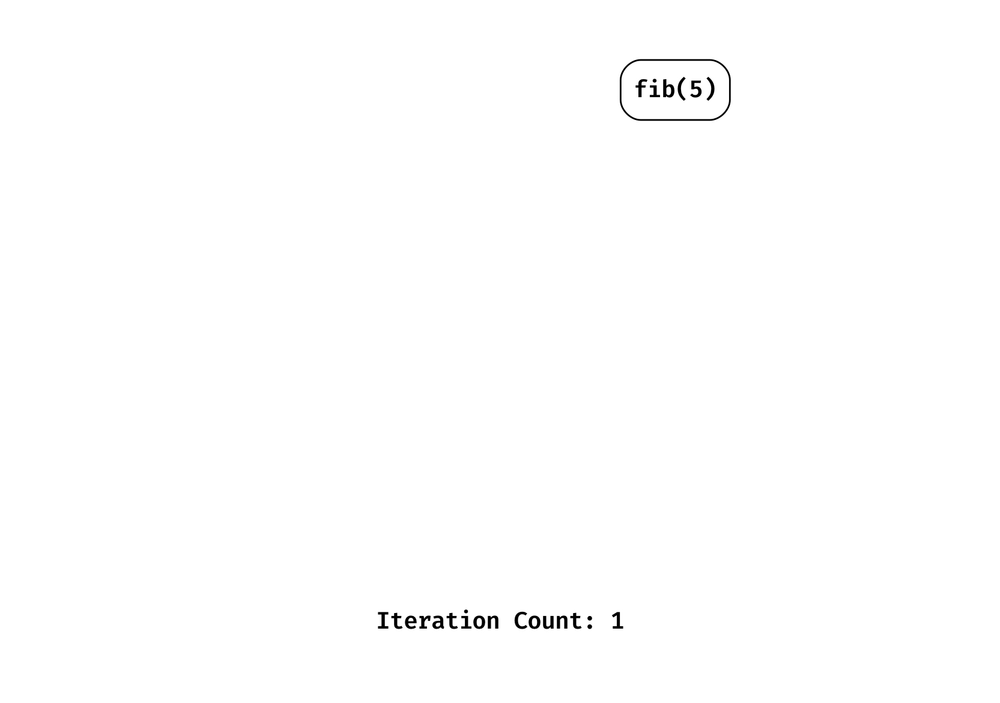
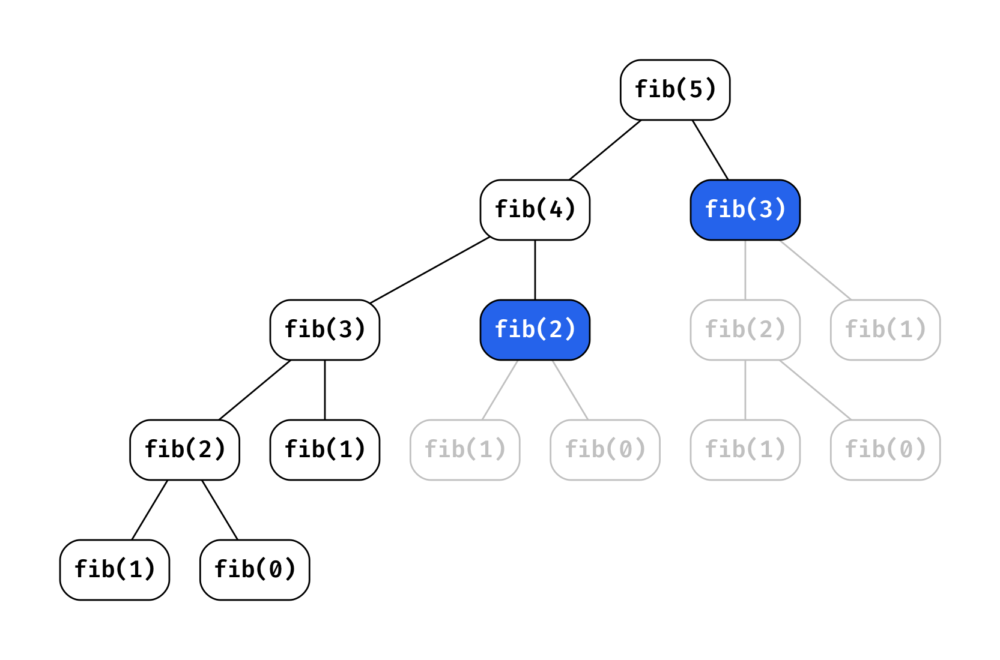
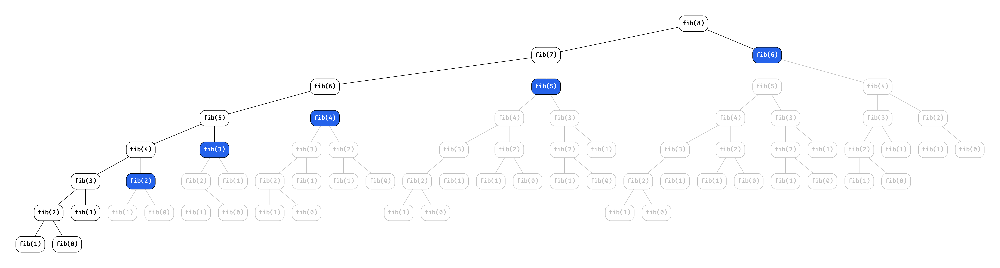
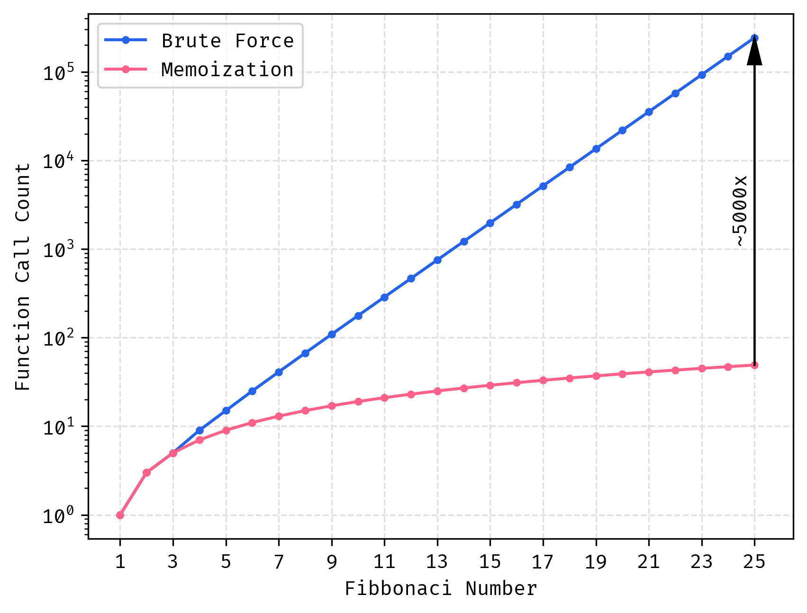
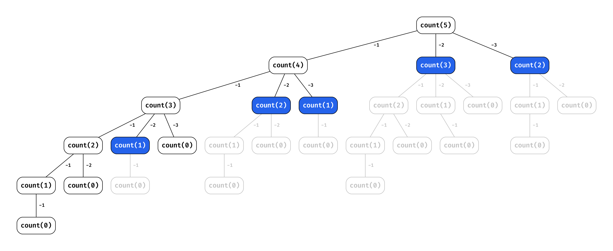
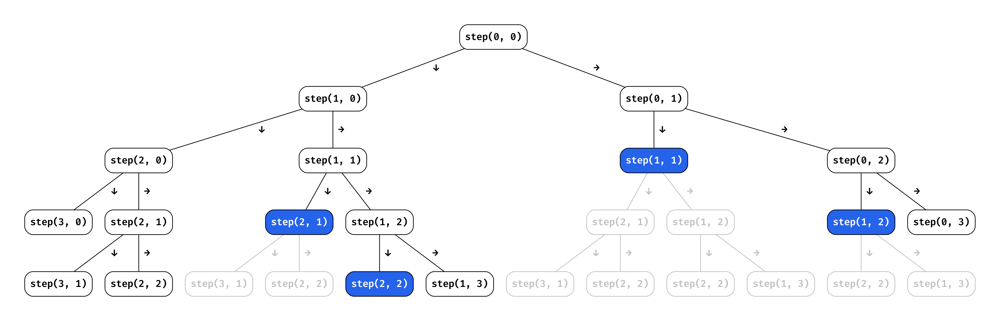
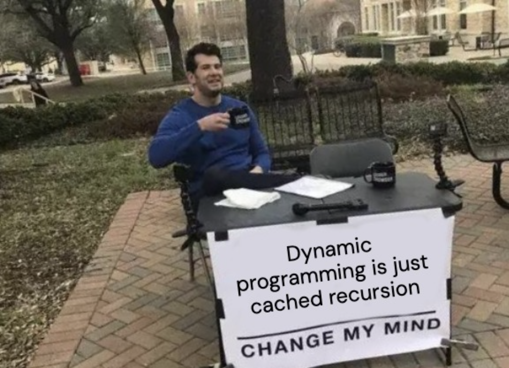

Dynamic programming is a common nemesis in coding interviews. People see "optimal substructure" and "overlapping subproblems" and immediately panic. I realized DP isn't the dark arts, it's just a systematic way to avoid doing the same work twice.

Once you understand the reasoning patterns, DP problems become much more approachable. This post breaks down the step-by-step thinking that turns intimidating problems into manageable solutions. Whether you're prepping for interviews or just want to understand how these algorithms work, we'll start with Fibonacci and build up to the classic problems you'll encounter on LeetCode and in technical interviews.

# Recognize When You Need It

Before diving into fancy terminology, here's when you should reach for DP:

- You're solving the same subproblems over and over (`fib(3)` multiple times)
- You're making choices that affect future choices (items in knapsack)
- The brute force solution is exponential but _feels_ like it shouldn't be

The technical terms matter too:

1. **Overlapping subproblems**: You keep solving the same smaller problems
2. **Optimal substructure**: The best solution uses best solutions to smaller problems

But here's the practical test: if your recursive solution is painfully slow and you're recalculating things, DP can probably help mitigate the repetition.

# Why Fibonacci Breaks Your Computer

Fibonacci seems innocent enough, each number is just the sum of the two before it. The recursive solution looks clean and mirrors the mathematical definition perfectly:

```python
def fib(n):
    if n < 2:
        return n
    return fib(n-1) + fib(n-2)
```

This works great for small numbers. `fib(5)` runs instantly. `fib(10)` is fine. But try `fib(40)` and go make coffee because you'll be waiting a while.

We need to consider why the problem scales exponentially when intuitively it shouldn't? If I asked you to calculate `fib(5)` by hand, you'd probably do a sliding window of size 2 starting with 0 and 1 and going from there on paper.

```
fib(5) = fib(4) + fib(3)
fib(4) = fib(3) + fib(2)
fib(3) = fib(2) + fib(1)
fib(2) = fib(1) + fib(0)
fib(1) = 1
fib(0) = 0
```

Which feels entirely linear no? But it's not. The recursive solution is actually exponential because it recalculates the same subproblems over and over again.

To better understand the execution order, here's how the recursive calls unfold:



We see that the tree is height `n` and for each node, we calculate 2 other function calls. This in turn means we will have `2^n` total function calls, exponentially growing with `n`.

Follow the call order again, consider how many times we hit a call that we've already solved before. What if we could just save the results of these calls and return them and avoid traversing down paths we've already seen before?



Notice the blue nodes? Those represent subproblems we've already solved! For `fib(5)`, we calculate `fib(3)` and `fib(2)` twice. This redundancy grows exponentially as n increases, consider what this looks like for `fib(8)`.



All the grey nodes are calculations we get to avoid because we saved the results of prior problems and time we save! In practice, we linearized an exponential solution. I'll detail more about how to implement this, but for now just know it's called **memoization**.

# The Performance Disaster

The performance difference isn't just bad, it's catastrophically bad:



Here are some real numbers that'll make you appreciate memoization:

- `fib(25)`: 242,785 function calls vs 49 calls (5,000x improvement)
- `fib(35)`: ~30 seconds vs microseconds
- `fib(40)`: several minutes vs still microseconds

# Demystifying DP

This is the how I tackle DP problems for interviews, LeetCode, or [Project Euler](https://projecteuler.net/).

## Step 1: Think Recursively First

Don't worry about DP yet.

Just think: "How can I break this into smaller versions of the same problem?"

This step is crucial because DP problems are fundamentally recursive problems with optimizations. If you can't solve it recursively, you can't solve it with DP.

- What smaller subproblems do I need to solve?
- What are my base cases?
- What choices am I making at each step?

## Step 2: Write Out the Recurrence Relation

All DP problems can be solved with recursion, I opt to only look at these solutions in this post to generalize the process. The recurrence relation is the formula that describes how to compute the solution to a problem using the solutions to its subproblems.

$$
\text{fib}(n) = \text{fib}(n-1) + \text{fib}(n-2)
$$

In interviews, I always write this out clearly. It shows you understand how the problem breaks down and gives you something concrete to implement.

## Step 3: The Base Cases

Base cases are where recursion stops. It defines the bounds of the problem, exceptions, etc. that terminate the recursive call order. For `fib` this means that we never compute any input less than 0, and we implicitly know the solution for 0 and 1.

```python
if n < 2:
    return n  # fib(0) = 0, fib(1) = 1
```

## Step 4: Naive Recursive Solution

Get the basic version working first. Don't optimize yet:

```python output=1
def fib(n):
    if n < 2:
        return n
    return fib(n-1) + fib(n-2)

print(f"Expecting 5 for the solution to fib(5), got: {fib(5)}")
Expecting 5 for the solution to fib(5), got: 5
```

Test it on small inputs. If this doesn't work, neither will the DP version.

```python output=1
from time import perf_counter

def test_fib(n):
    start = perf_counter()
    result = fib(n)
    elapsed_ms = (perf_counter() - start) * 1_000
    print(f"fib({n}) = {result}, time taken: {elapsed_ms:.6f} milliseconds")

test_fib(25)

fib(25) = 75025, time taken: 9.768667 milliseconds
```

## Step 5: Recognize the Inefficiency

Run your naive solution on larger inputs. When it gets slow, you've found your overlapping subproblems. That's your cue that memoization will help. In interviews if you have a plenty fast solution at this point, you can opt to mention DP but it may not be needed.

## Step 6: Add Memoization

Now optimize by storing results you've already computed, we're simply going to use a dictionary to store the results of each function call keyed by the function inputs.

```python output=1
def fib(n, memo={}):
    # If we've saved the result for this input before, return it
    if n in memo:
        return memo[n]

    # Still need to handle base cases
    if n < 2:
        return n

    # Save the result for later
    memo[n] = fib(n-1, memo) + fib(n-2, memo)
    return memo[n]

test_fib(25) # We expect this to be much faster

fib(25) = 75025, time taken: 0.010667 milliseconds
```

Compared to our naive solution, we see a time reduction from 9.77 ms to ~0.01 ms.

## The Critical Insight: State Definition

Here's what trips up most people, your function parameters _must_ completely describe the current state of your problem i.e. implies everything to condition your execution.

For Fibonacci, just `n` tells us everything we need to know. But for more complex problems, you might need multiple parameters. The test is: given just the parameters, can you solve the problem from that point without any additional information?

The important intution for both DP and the naive recursive solution is this actually, without this understanding you cannot even solve it naively which means if you have a naive solution, you have the ability to convert it to a DP solution trivially!

This is crucial for interviews because it shows you understand the problem deeply.

# Beyond Fibonacci: More Examples

Let's look at two more classic DP problems to see how the same systematic approach applies, goal for you is to try this on your own before looking at the solution.

## Coin Change

You are given an integer array coins representing coins of different denominations and an integer amount representing a total amount of money.

Return the fewest number of coins that you need to make up that amount. If that amount of money cannot be made up by any combination of the coins, return -1.

You may assume that you have an infinite number of each kind of coin.

<Collapse title="Solution, don't cheat!">

**Recurrence Relation**

For any amount, try every available coin and take the best result. Consider the height of the tree as the number of coins chosen.

```
coin_change(amount) = 1 + min(coin_change(amount - coin) for each valid coin)
```

**Base cases**

Some simple base cases to guard the operation of the algorithm.

```python
if amount < 0: # If amount is negative, it's impossible to make change
    return float('inf')
if amount == 0: # If amount is zero, no coins are needed
    return 0
```

**Memoized Solution**

Pretty simple extensions of the prior assertions.

```python
def coin_change(coins, amount, memo={}):
    if amount in memo:
        return memo[amount]
    if amount < 0:
        return float('inf')
    if amount == 0:
        return 0

    min_coins = float('inf')
    for coin in coins:
        min_coins = min(min_coins, coin_change(coins, amount - coin, memo) + 1)

    memo[amount] = min_coins
    return memo[amount]
```

**Example Call Tree**

Running this for `coin_change([1,2,3], 5)`, we can see just how much we save.



</Collapse>

## Minimum Path Sum

Given a m x n grid filled with non-negative numbers, find a path from top left to bottom right, which minimizes the sum of all numbers along its path.

Note: You can only move either down or right at any point in time.

<Collapse title="Solution, don't cheat!">

**Recurrence Relation**

From any cell, the minimum path equals the cell's value plus the minimum of the two possible next steps. Consider how we explore right and down paths.

```
min_path(r, c) = grid[r][c] + min(min_path(r+1, c), min_path(r, c+1))
```

**Base cases**

Some simple base cases to guard the operation of the algorithm.

```python
if r >= m or c >= n: # Out of bounds, invalid path
    return float('inf')
if r == m-1 and c == n-1: # Reached destination
    return grid[r][c]
```

**Memoized Solution**

Pretty simple extensions of the prior assertions.

```python
def min_path_sum(grid, memo={}):
    m, n = len(grid), len(grid[0])

    def solve(r, c):
        if (r, c) in memo:
            return memo[(r, c)]
        if r >= m or c >= n:
            return float('inf')
        if r == m-1 and c == n-1:
            return grid[r][c]

        memo[(r, c)] = grid[r][c] + min(solve(r+1, c), solve(r, c+1))
        return memo[(r, c)]

    return solve(0, 0)
```

**Example Call Tree**

Running this for a 3x3 grid, we can see just how much we save.



</Collapse>

# Practice Problems to Try Next

- **[Tribonacci](https://leetcode.com/problems/n-th-tribonacci-number/)**: Find the nth number in the Tribonacci sequence
- **[Unique Paths](https://leetcode.com/problems/unique-paths/)**: Count the number of unique paths from top-left to bottom-right
- **[House Robber](https://leetcode.com/problems/house-robber/)**: Maximize money robbed without robbing adjacent houses
- **[LCS](https://leetcode.com/problems/longest-common-subsequence/)**: Find longest common subsequence between two strings

The next time you encounter a problem that seems to require exploring multiple paths or making optimal choices at each step, ask yourself: "Could this benefit from dynamic programming?" The answer might just transform an impossible problem into a trivial one.


