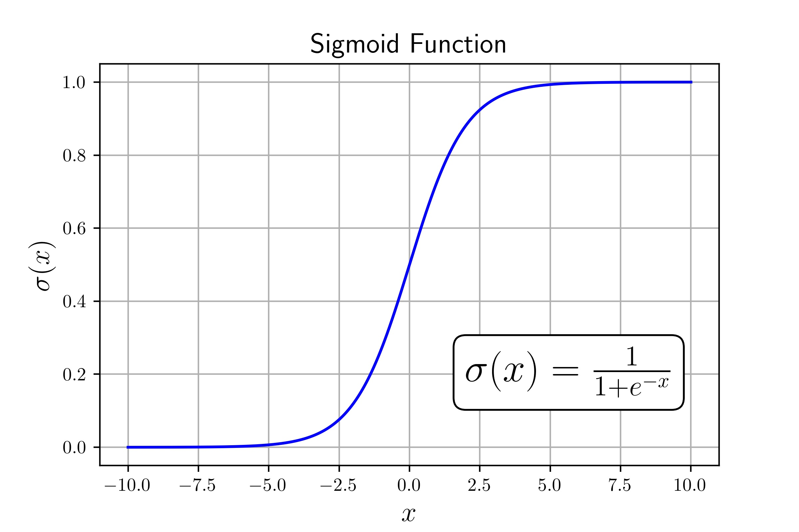

import figure8 from "./assets/figure8_anim.mp4";

import Collapse from '../../../../components/MDX/Collapse.jsx';

# Heading 1
## Heading 2
### Heading 3

---

## Collapse

<Collapse client:load title="Test Title">
    
Content to be hidden

</Collapse>

**Bold Text**
*Italic Text*
~~The world is flat.~~

- [x] Write the press release
- [ ] Update the website
- [ ] Contact the media

> Blockquote

Inline Code `code`

# Footnote
Here's a sentence with a footnote. [^1]

[^1]: This is the footnote.

# General Layout

## Numbered List
1. Test
2. Test

## Unordered List
- Test
- Test

# Latex

export const f2 = '\\overbrace{a+b+c}^{\\text{a sum of three numbers}}';

<Tex formula={f2}/>

Testing inline math $1+1=2$ and more

# Image

# Video

<PostVideo video={figure8} _autoplay={false}/>

<PostVideo video={figure8} _autoplay={true}/>
