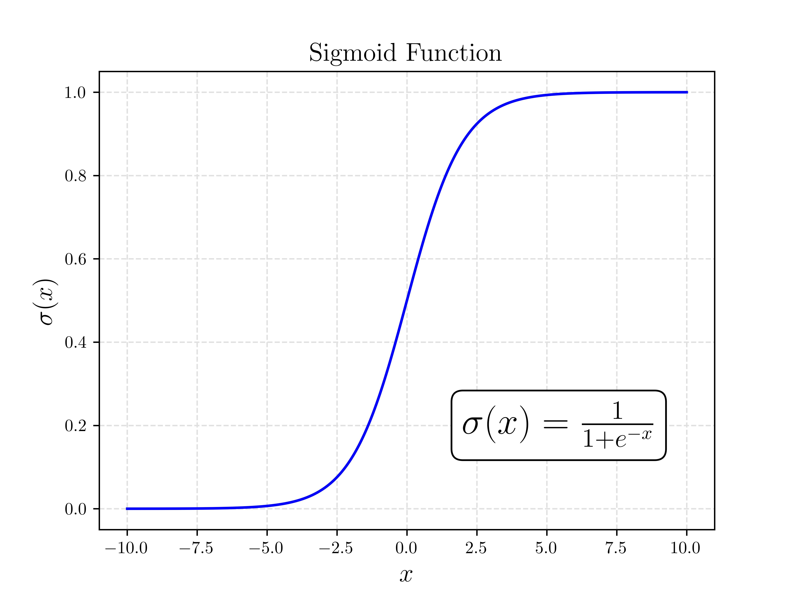
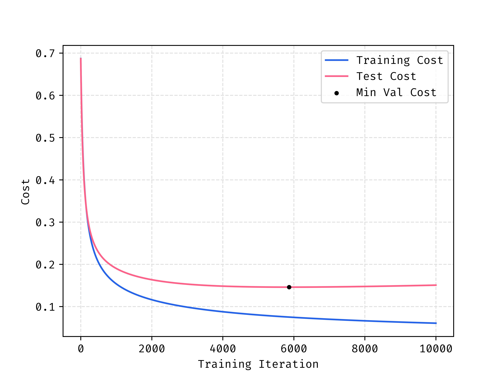
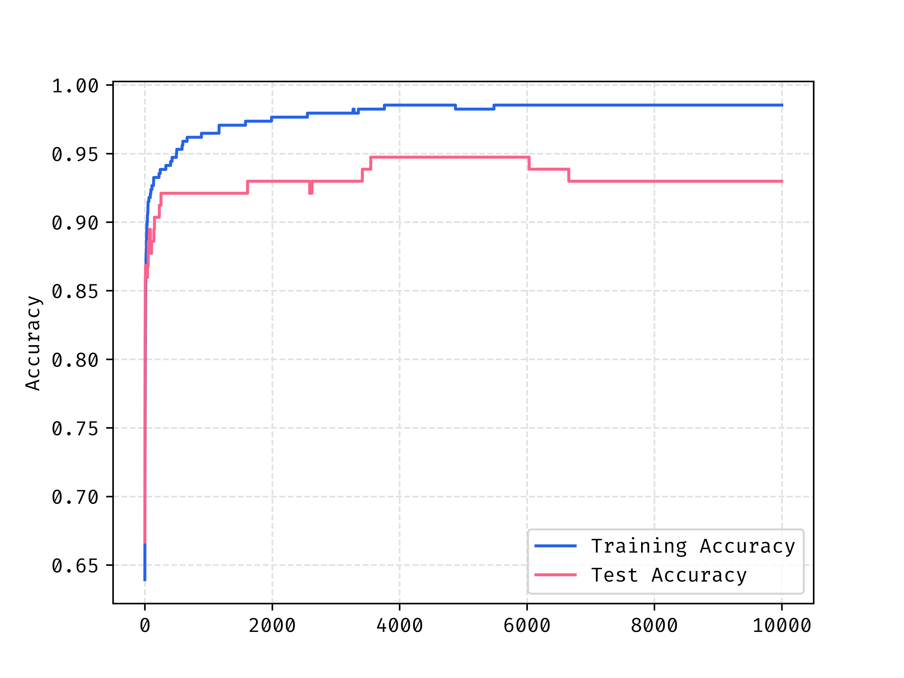

---

published: true
title: What is Logistic Regression?
slug: logistic-regression-intro
date: 2020-12-23
cover: images/accuracy_crop.jpg
tags: ["Machine Learning", "Optimization"]
category: "Machine Learning"
excerpt: "How to implement a logistic regression model with a neural network mindset in Python."
pinned: false
---

This post will introduce you to the principles behind logistic regression as a binary classification method. Using NumPy we'll implement the model from scratch.

There are different ways to implement this particular algorithm but I will focus on an implementation with a neural network mindset.

# What is Logistic Regression?

Logistic regression is a predictor borrowed from statistics used for binary classification. In english this means that we can use the model to determine is an input example belongs to a group or not. As an example, if we knew certain features about the weather (temperature, humidity, wind, etc.) we could try to predict if it's going to rain or not. To do so, we need many _labeled_ examples (inputs + did it rain) of data from other days.

# Data Organization

We represent a particular example as a vector of features and we store all these examples as one large matrix $X$ where $X_i$ is a particular example (a single day if we follow our prior rain metaphor). The labeled aspect means that we know whether or not that day had rain, we'll call this the ground-truth and save all labels for our examples in a vector $y$ where we store a 0 for the days it didn't rain and a 1 when it does rain.

As an example, let's imagine that we track 2 different aspects to describe each day such as average temperature and humidity. For a year, we would have 365 examples of temperature and humidity stored in our vector $X$ and the rain history in our vector $y$.

$$
X = [365 \times 2] =
\begin{bmatrix}
72 & 0.42\\
55 & 0.92\\
\vdots & \vdots \\
53 & 0.95\\
71 & 0.43\\
\end{bmatrix}
$$

$$
y=[365 \times 1] =
\begin{bmatrix}
0\\
1\\
\vdots \\
1\\
0\\
\end{bmatrix}
$$

# Forward Propagation

The forward propagation step is where we take an example day $X_i$ and pass it through our model to yield a prediction $\hat{y_i}$. We need a signal of how *important* each of the input signals is to whether it rained and in which direction it pushes our guess.

The importance as I called it is more aptly called the weight, we store a weight value for each of our input values (humidity and temperature). A positive weight implies that an increase in the input signal corresponds to a higher likelihood of predicting true. Across all our possible inputs, it's easier to combine all the weights into one vector $W$.

We may need to shift our baseline as well, to do this we include an offset that in a way sets our *start* for where we start allowing our inputs to change off of, called the bias $b$.

Lastly, we need a way of "squashing" the signal down to yes and no. This is best done as a probability where 0 says definetely not, and a 1 is very confident. We want to take the loudest of voice, and quietest of whispers and clamp them to a range we actually know how to handle. This is done with the sigmoid function $\sigma$.

$$
\hat{y_i} = \sigma (W^\top X_i + b)
$$



Where $\hat{y_i}$ is the probability that the example is in the class we are trying to predict. For the rain example, this is the logistic regressions estimated probability that it will rain that day. The sigmoid function is well catered to this as it introduces a non-linearity that bounds the output between 0 and 1, perfect for a probability!

## Example Forward Propagation

Let's consider our example $X$ in the prior data organization section. I understand that at this point I have not discussed how to determine $W$ and $b$ but for now follow that we know it, we will discuss how to find the correct values in the next section. Let's use the following:

$$
W^\top = [1 \times 2] =
\begin{bmatrix}
0.1 & 10
\end{bmatrix}
$$

$$
b = -13
$$

We can actually go ahead and bulk propagate all examples using matrix multiplication! Let's use $X$ and $y$ as the define days from before. What we're looking at here are 4 days worth of information with their respective humidities and temperatures.

$$
X = [4 \times 2] =
\begin{bmatrix}
72 & 0.42\\
55 & 0.92\\
53 & 0.95\\
71 & 0.43\\
\end{bmatrix}
$$

We can see in the corresponding $y$ that it rained on days 2 and 3.

$$
y=[4 \times 1] =
\begin{bmatrix}
0\\
1\\
1\\
0\\
\end{bmatrix}
$$

Following the equation for $\hat{y_i}$ we get the following:

$$
\hat{y_i} = [4 \times 1] = \sigma (W^\top X^\top + b)
$$

$$
\hat{y_i} = \sigma (
\begin{bmatrix}
0.1 & 10
\end{bmatrix}

\begin{bmatrix}
72 & 55 & 53 & 71\\
0.42 & 0.92 & 0.95 & 0.43\\
\end{bmatrix}
-13
)
$$

$$
\hat{y_i} =
\sigma(
    \begin{bmatrix}
    -1.6 & 1.7 & 1.8 &-1.6 \\
    \end{bmatrix}
)
$$

$$
=
\begin{bmatrix}
0.17 & 0.85 & 0.86 & 0.17 \\
\end{bmatrix}
$$

When we compare those probabilities to the known results we can see they match! Days that had rain (days 2 and 3) show high probabilities that it rained and the non rain days respectively show low probabilities. In practice you can get a prediction as a 1 or 0 by rounding the probability, the idea is you round towards the prediction that is more likely in the probability. In the case of logistic regression where there are only two possibilities (rain or didn't) you can estimate one from the other very easily.

$$
\text{P}_{\text{Clear}} = 1 - \text{P}_{\text{Rain}}
$$

## Bias Simplification

A trick I've seen is to move the bias term ($b$) into the matrix multiplication ($W^\top X_i$).

This is done by adding a column of 1's to the end of $X$, adding a feature that is consistent across all examples. Then we increase the size of the weights by 1 (now $W',X'$ etc.) such that the last weight acts as the bias. Check the math below if you are still curious.

For the sake of expanding this into greater content and not making reductions that are specific to this problem, I will opt to not do this but thought I'd mention it.

> $$
> W^\top X + b  = w_1 x_1 + ... + w_n x_n + b
> $$
>
> $$
> = w_1 x_1 + ... + w_n x_n + w_{n+1} [1,1,...,1]
> $$
>
> $$
> = W'X'
> $$

## Finding the Correct $W$ and $b$

It can be difficult/impossible to determine the correct values for the weights and bias through trial and error. Even for small examples of only two input features it's challenging to get correct, let alone when we step into many more.

To correctly determine the values we use a process called training!

# Training

Training is the process where we take many labeled examples and use them to determine values for $w$ that will yield us the best _overall_ performance. To be precise, we will describe some formulations for what are called the cost and loss of the model.

## Loss Function

Let's start with the loss function. The loss is a measure of the error for a particular example's prediction. Following our prior notation the loss for one example is:

$$
\mathcal{L} = -y \log(\hat{y}) - (1-y) \log(1-\hat{y})
$$

This function evaluates the error differently depending on the true label $y$. Let's play this out and see why it makes sense.

### Case 1: It Rained

When the actual outcome is rain ($y=1$), the loss simplifies to:

$$
\mathcal{L} = -(1) \log(\hat{y}) - (1 - 1)\log(1 - \hat{y})
$$

$$
\mathcal{L} = -\log(\hat{y})
$$

An ideal prediction would have $\hat{y} = 1$, resulting in:

$$
-\log(1) = 0
$$

Predicting any probability lower than 1 (less certain of rain) increases the loss.

### Case 2: It Did Not Rain

When there's no rain ($y=0$), the loss becomes:

$$
\mathcal{L} = -(0)\log(\hat{y}) - (1 - 0)\log(1 - \hat{y})
$$

$$
\mathcal{L} = -\log(1 - \hat{y})
$$

Here, the ideal prediction is $\hat{y} = 0$, yielding:

$$
-\log(1 - 0) = -\log(1) = 0
$$

Predicting higher probabilities incorrectly indicating rain increases the loss significantly.

### Intuition

The logistic regression loss function quantifies prediction errors for both outcomes ($y=0$ or $y=1$), penalizing predictions increasingly as they diverge from the observed reality.

## Cost Function

The cost function is easy, it's just the average of the loss functions so:

$$
C = \frac{1}{N}\sum_{i=1}^{N} \mathcal{L}_i
$$

The cost gives us an idea of how we are doing *overall* against all of our data.

We want to find a way to reduce this to the lowest value possible. To do so, we use an optimization method called gradient descent.

## Gradient Descent

This method isn't the focus of the post, so if this feels bit heavy don't worry too much. I introduce this as the method of choice because neural networks also use it so it's good to get exposure to it here!

Gradient descent is fairly simple, given the [gradient](https://www.youtube.com/watch?v=tIpKfDc295M&ab_channel=KhanAcademy) of a function with respect to the variable to be optimized take a step in the negative direction of the gradient (positive for gradient ascent) and update your inputs with the step. Keep repeating this until you are happy with the convergence. In general, it looks something like this:

$$
\theta_{i+1} = \theta_i - \alpha \nabla f(\theta)
$$

Where $\alpha$ is a tuneable parameter called the learning rate, it dictates how fast or slow we should update our parameters relative to the gradient. I will not go through [the derivation](https://web.stanford.edu/class/archive/cs/cs109/cs109.1166/pdfs/40%20LogisticRegression.pdf), but for our problem we would like to use gradient descent where $f$ is the cost function and we take the gradient in terms of $W$ and $b$. For our use case this is:

$$
W_{i+1} = W_i - \alpha \frac{1}{N} X^\top (\hat{\mathbf{y}} - \mathbf{y})
$$

$$
b_{i+1} = b_i - \alpha \frac{1}{N} \sum_{i=1}^{n} (\hat{y}_i - y_i)
$$

# Implementation

Let's go ahead and import our python modules first as follow:

```python
import numpy as np
from sklearn.model_selection import train_test_split
from sklearn.datasets import load_breast_cancer
from sklearn.preprocessing import StandardScaler
```

I will be using Python/NumPy for the implementation. The dataset used is imported in our prior code block with the rest of our libraries. The dataset takes a few human health metrics as features and tries to predict if the patient has breast cancer, you can read more [here](https://scikit-learn.org/stable/modules/generated/sklearn.datasets.load_breast_cancer.html).

## Model Class

We'll package this a class just to keep everything together.

```python
class LogisticRegression:
    def sigmoid(self, z):
        pass

    def cost(self, y, y_hat):
        pass

    def train(self, X, y):
        pass

    def predict_prob(self, X):
        pass

    def predict(self, X):
        pass
```

- `sigmoid` will be our implementation of the aforementioned non linear function
- `cost` will be used to compute the cost across a set of many predictions
- `train` will take the training input $X$ and the corresponding outputs $y$
- `predict_prob` will return the predicted probabilities from the model weights
- `predict` will use the probability to return a class decision

Populating all the methods and `__init__` yields the following:

```python
class LogisticRegression:
    def __init__(self, learning_rate=0.01, epochs=1000):
        self.learning_rate = learning_rate
        self.epochs = epochs

    def sigmoid(self, z):
        return 1 / (1 + np.exp(-z))

    def cost(self, y, y_hat):
        loss = -y * np.log(y_hat) - (1-y) * np.log(1-y_hat)
        return np.average(loss)

    def train(self, X, y):

        # Initialize Weights Randomly, Bias to 0
        n_samples, n_features = X.shape
        self.W = np.random.randn(n_features)
        self.b = 0

        # Gradient Descent
        for i in range(self.epochs):
            # Get Probabilities
            y_predicted = self.predict_prob(X)

            # Compute Gradients
            diff = y_predicted - y
            dW = (1 / n_samples) * np.dot(X.T, diff)
            db = (1 / n_samples) * np.sum(diff)

            # Update Model Parameters
            self.W -= self.learning_rate * dW
            self.b -= self.learning_rate * db

    def predict_prob(self, X):
        linear_model = np.dot(X, self.W) + self.b
        return self.sigmoid(linear_model)

    def predict(self, X):
        y_predicted_prob = self.predict_prob(X)
        return np.round(y_predicted_prob)
```

With the dataset and prep methods we imported prior we can fashion a test. It's customary to split the data into a test/train split where we train on a larger fraction of the data, and then test our performance on an unseen part of the dataset to see how well the model generalizes.

```python output=2
# Load in data
data = load_breast_cancer(return_X_y=True)

# Split into X and y
X = data[0]
y = data[1]

# Test Train Split
X_train, X_test, y_train, y_test = train_test_split(X, y, test_size=0.40, random_state=12)

# Standardize Input Data
scaler = StandardScaler()
X_train = scaler.fit_transform(X_train)
X_test = scaler.transform(X_test)

# Instantiate Model and Train
MyModel = LogisticRegression(0.2, 2500)
MyModel.train(X_train, y_train)

y_train_pred = MyModel.predict(X_train)
train_accuracy = np.sum(y_train_pred == y_train) / y_train_pred.size
y_test_pred = MyModel.predict(X_test)
test_accuracy = np.sum(y_test_pred == y_test) / y_test_pred.size
print(f"Accuracy on train: {train_accuracy:0.3f}")
print(f"Accuracy on test: {test_accuracy:0.3f}")

Accuracy on train: 0.997
Accuracy on test: 0.969
```

## Overfitting

A problem that we see in machine learning a lot called overfitting. The model only sees the training data set, and with a sufficiently large model and enough training the model can learn to match the input training data *too* well. When this happen, the performance of the model on the unseen or "test" data regresses, so we want to stop earlier than this stage.

When looking at the costs of both the training and test data during training we see that the minimum cost for test data happens well before the end of training. Past this point the model is overfitting to the training data so we see that cost reducing, but this provides no value to us because the test and unseen data in the future is ALL that matters.



This is also reflected in the accuracy at roughly the same place in the training stage.



# Conclusion

Logistic regression may be simple, but it’s a powerful gateway into the world of classification and machine learning in general. By walking through its mathematical intuition, implementation from scratch, and interpretation, we’ve laid the groundwork for understanding more advanced models like neural networks in future posts.

Thanks for reading, hope it sparked something!
