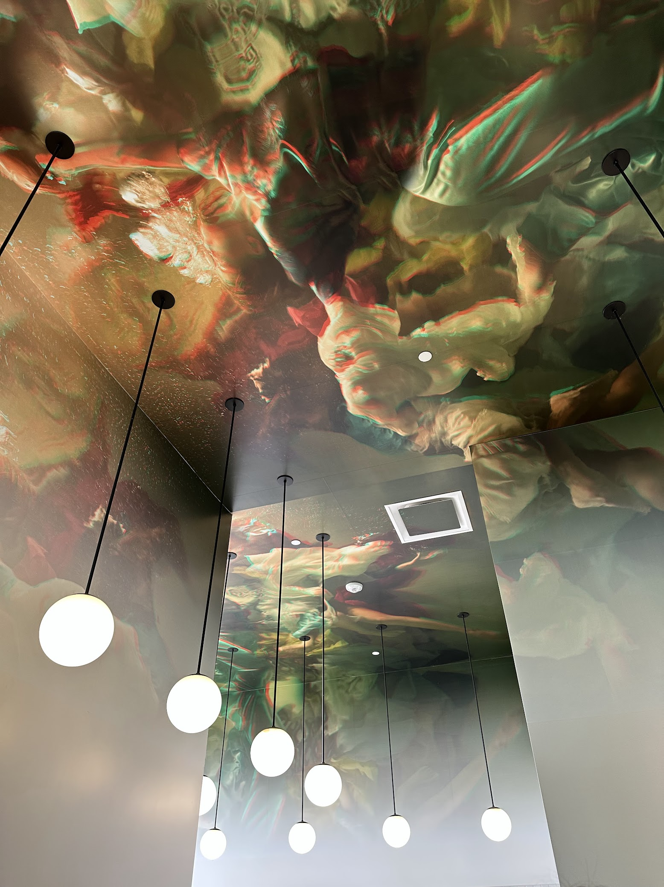

I'm that person who will drive twenty minutes out of the way for good coffee.

This is my running log of coffee spots I've tried. Just notes on what worked and what didn't.

{/* ★★★☆☆ */}
{/* ★★★★☆ */}
{/* ★★★★★ */}

# Stereoscope 🔭

## 📍 Newport Beach, CA · Jul. 31, 2023

**Drink Order:** Iced Madagascar Vanilla Latte

| Category | Rating | Notes                                                                           |
| -------- | ------ | ------------------------------------------------------------------------------- |
| Drink    | ★★★★★  | Good espresso and pour overs. They know what they're doing with single origins. |
| Food     | ★★★★★  | Really good breakfast plate. The jam is excellent.                              |
| Service  | ★★★☆☆  | Can be slow and a bit distant during busy times. Not unfriendly, just detached. |
| Ambience | ★★★★★  | Clean design, nice ceiling detail inside, outdoor patio gets good light.        |
| Vibe     | ★★★★☆  | Modern but comfortable. Mix of brunch crowd and people working.                 |

Every shot is dialed in and the kitchen moves at its own pace. The payoff is clear: layered espresso, pour-over flights where you can taste the differences, and a breakfast plate that overachieves for a café. Come with time to spare and leave both wired and full.

# Component Coffee Lab 🧪

## 📍 Visalia, CA · Jul. 17, 2022

**Drink Order:** Hot Sweet Latte (Half Sweet)

| Category | Rating | Notes                                                                |
| -------- | ------ | -------------------------------------------------------------------- |
| Drink    | ★★★☆☆  | Decent coffee, nothing special. Some interesting seasonal drinks.    |
| Food     | ★★★★☆  | Good breakfast burritos and toast options beyond the usual pastries. |
| Service  | ★★★★★  | Friendly staff, no rush to turn tables.                              |
| Ambiance | ★★★★☆  | Nice warm interior with brick and wood. Comfortable seating.         |
| Vibe     | ★★★★★  | Good mix of modern and cozy. Easy to work here.                      |

Component lives in a converted planing mill: brick, timber, plants, brass. Order the breakfast burrito, open the laptop, and settle in. Staff won’t rush you and the room stays comfortable for a multi-hour work session.

# Stell Coffee and Tea 🍵

## 📍 Redlands, CA · Nov. 18, 2022

**Drink Order:** Iced Vanilla Latte (Half-Sweet)

| Category | Rating | Notes                                                    |
| -------- | ------ | -------------------------------------------------------- |
| Drink    | ★★★☆☆  | Standard coffee shop drinks. Reliable but nothing fancy. |
| Food     | ★★★★☆  | Good sandwiches and they do pasta salad which is nice.   |
| Service  | ★★★★☆  | Friendly counter service. They remember regulars.        |
| Ambience | ★★★☆☆  | Casual inside, patio gets good sun.                      |
| Vibe     | ★★★★☆  | Neighborhood place, relaxed and unpretentious.           |

Stell bets on neighborhood comfort over third-wave pageantry. Vanilla lattes, turkey clubs, and the obligatory scoop of pasta salad keep regulars loyal. Staff learn names; customers linger.

# Anecdote Coffee 🎷

## 📍 Vancouver, BC, Canada · Mar. 14, 2024

import figure8 from "./images/anecdote.mp4";

<PostVideo video={figure8} alt="Who Doesn't Like Jazz" aspectRatio={0.5625} />

**Drink Order:** Flat White (Half-Sweet Simple Syrup)

| Category | Rating | Notes                                                   |
| -------- | ------ | ------------------------------------------------------- |
| Drink    | ★★★★☆  | Good flat whites and standard espresso drinks.          |
| Food     | ★★★☆☆  | Pastries and light snacks. Nothing substantial.         |
| Service  | ★★★☆☆  | Quiet and low-key. They keep things calm.               |
| Ambience | ★★★★☆  | Clean design, good natural light, comfortable seating.  |
| Vibe     | ★★★★★  | Peaceful spot, nice break from the busy street outside. |

Quiet spot with light jazz and big windows. Good for sitting with a flat white and a book for a while.

# Farine Bakery & Cafe 🥐

## 📍 Redmond, WA · Mar. 18, 2023

**Drink Order:** Hot Vanilla Latte (Half-Sweet)

| Category | Rating | Notes                                                               |
| -------- | ------ | ------------------------------------------------------------------- |
| Drink    | ★★★★☆  | Good espresso, though the food is clearly the main event.           |
| Food     | ★★★★★  | Real bakery with excellent croissants and tartines. Worth the trip. |
| Service  | ★★★★☆  | Busy but friendly. They handle crowds well.                         |
| Ambience | ★★★★★  | High ceilings and lots of natural light. Nice industrial feel.      |
| Vibe     | ★★★★★  | Busy and social. Popular with families.                             |

Good place to spend a morning. The tartines are solid and the croissants keep coming. Easy to lose track of time.

# Captain + Stoker 🚲

## 📍 Monterey, CA · Oct. 2, 2023

**Drink Order:** Hot Flat White

| Category | Rating | Notes                                                     |
| -------- | ------ | --------------------------------------------------------- |
| Drink    | ★★★☆☆  | Coffee looks good but often tastes weak.                  |
| Food     | ★★★☆☆  | Basic menu with toast and salads. Nothing special.        |
| Service  | ★★★★☆  | Friendly staff, though service can be inconsistent.       |
| Ambience | ★★★★★  | Bright space with big garage doors. Bikes everywhere.     |
| Vibe     | ★★★★★  | Local hangout spot. More about the scene than the coffee. |

Garage doors open to the street, bikes parked outside. The espresso is fine but the relaxed atmosphere is what makes it worth visiting.

# Coffee @ Home 🏡

## 📍 City in CA? · All Day Every Day

**Drink Order:** Anything and Everything

| Category | Rating | Notes                                                                                   |
| -------- | ------ | --------------------------------------------------------------------------------------- |
| Drink    | ★★★★★  | Dialed to your taste, made with care, and not a single burnt shot in sight.             |
| Food     | ★★★★☆  | Depends on the day, but strong odds of something nutrient-dense and secretly optimized. |
| Service  | ★★★★★  | Responsive, intuitive, and just always knows your order.                                |
| Ambience | ★★★★★  | Counter space squared off with precision. Light hits the matcha just right.             |
| Vibe     | ★★★★★  | Quiet, focused, and entirely yours. Best seat is always open.                           |

The home bar is the control group: beans you picked, water you trust, and exactly the milk texture you like. No line, no tip jar, just predictable excellence under familiar light.
