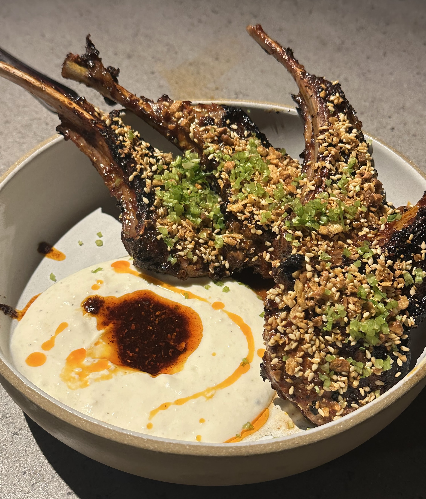

Before we step into this, I am not a doctor (at the dismay of my parents) but just someone who overly obsessed about nutrition for long enough to have thoughts about health. Take this with a grain of salt, though you really should be getting closer a half teaspoon per day.

# 🧩 Engineering The Perfect Diet

Let me first say I love tasty food more than just about anyone, a foodie at heart and an amateur chef in my free time. The goal of this system was not to eat soulless food that just covers macros, or to starve myself in the conventional _diet_ sense, but instead to attach the function/utility to food back on health and what it can do for my days and life.

One of the only things I love more than delicious food, is feeling great. Having sustainable energy, a sharp mind, no crashes, no stomach pain, etc. you get the point. This whole endeavor is a continual attempt at chasing those feelings, trying to make them easily attainable without having to buy sweetgreen every day, drink AG1, or spend hours cooking.

Hence the desire for a foundational understanding of food beyond the first pass check of macros. What foods fuel the body's underlying processes, organs, and other facets of the sort?

> What would my organs want to eat to feel their best and better my life?

# ✳️ Why Structure Matters

To motivate the need for structure, I want to first tackle the idea of _"intuitive eating"_.

I wish it worked. But in a food environment where ingredients are optimized for shelf life, dopamine, and convenience, _"eating till you're full"_ or _"following your gut"_ often leads to pretty poorly optimized diets when even these best of intentions are exercised.

Following this mentality left me feeling pretty lethargic, breaking out, and just not sharp. I wasn't eating junk food, or cushing a whole king size bag of chips, but something was off.

You might ask: _"what if I am eating only clean foods?"_ Fair question, but what exactly is _clean_?

### Natural Sources?

Consider if you'd prefer to drink water from a lake or from a filtered tap.

### Low Fat?

Do hormonal imbalances, poor brain function, and vitamin deficiencies sound desirable?

### Dairy Free?

Eliminating one of the best sources of bioavailable calcium, iodine, and vitamin K2 good?

My broader issue with the idea of intuitive eating is that our intuition about what foods do for us is often **misguided**, so why should we expect the results to be any better?

<Collapse title="Oranges or Kiwis for Vitamin C?">
  ### Kiwis have more Vitamin C than oranges (160mg vs 60mg per 100g)!
</Collapse>

This led me to take a staged approach to understanding food and its relationship with health.

# 🥩 Macros: The Foundation

I want to cover the first phase of piecing together my understanding, like any gym bro or social media nutritionist might do, we start with the macros to set the stage for most of the food.

## Limits of Eating Well Enough

Before I took the time to refine my macros, let's first consider the fact that my diet preceding this was actually not that bad. I wasn't eating substantial amount of processed/fast food nor was I drinking sodas or consuming sugar in excess, the classic advice we all know.

Substituting bits here and there for "healthier" options may have improved things marginally but at the end of the day my standard of living was still left to fatigue, breakouts, and poor mental clarity.

At least for me, it was fairly apparent that my attempts at eating clean and following my intuition was underserving me so I began to impose some structure, mostly in the form of weighing

## Tracking as Feedback, Not Control

Frame tracking macros not as obsession but as a debugging tool:
• Weighing food, noting meals
• Goals:
• Protein ~1g/lb
• 3 stable meals/day
• Reasonable fats/carbs
• Not dieting — just collecting data to spot patterns

## When Macros are Right

🥗 3 What Improved When Macros Were Right

Acknowledge the genuine gains of basic structure:
• Energy stabilized
• Workouts felt more consistent
• No more post-meal crashes or brain fog
• You built “repeatable meals” that just worked

## Are All Macros Equal?

🤔 4. But… Is All Protein Equal?

Pose the deeper questions that emerged:
• Do the sources of protein matter?
• Are there consequences to overemphasizing protein and neglecting carbs/fats?
• Is fat just a number, or does its type matter?
• Can I hit my macros and still miss something critical?

## Where Most People Stop

📉 5. Where Most People Stop

Highlight the stopping point for many well-intentioned plans:
• Macros dialed
• A multivitamin tossed in
• Maybe a protein shake or collagen for good measure
• This works for energy, body comp, and consistency
• But… what if you want more?

## A Frame Isn't a House

🧭 6. When Structure Isn’t the Destination

Tease the transition to micros:
• The structure worked — but you began noticing subtle gaps
• You didn’t want to feel “just okay,” you wanted clarity and confidence
• This wasn’t about more control — it was about knowing
• That’s when you zoomed into the next layer

# 🧬 Micros: Seeing the Gaps

## A Stable Frame, But Hollow Walls

    •	Transition from the macro section: you had structure, meals were predictable, energy was solid.
    •	But something still felt off — not broken, just… incomplete.
    •	Introduce the idea that micronutrients = operational depth of the system.

## What is Enough?

    •	Many diets appear solid on macros, but miss the micronutrient mark entirely.
    •	“You don’t feel vitamin deficiencies immediately — but they compound.”
    •	You started asking: What am I missing that I’m not even looking for?

## The Multivitamin Myth

    •	Common fallback: just take a multi and call it good.
    •	The flaw: most multis don’t cover what you specifically need, and they aren’t always absorbed well.
    •	Introduce the idea of food-first, supplement-second strategy.

## Common/Critical Deficiencies

    •	Magnesium → mood, sleep, muscle relaxation
    •	Potassium → heart rhythm, blood pressure, nerve signaling
    •	Choline → brain health, liver function, neurotransmitters
    •	Vitamin K2 → calcium transport, arterial health
    •	Vitamin E → antioxidant, cellular defense
    •	Selenium → thyroid function, immune regulation
    •	Keep it punchy, just enough to give each one meaning

## Debugging the Day

    •	You built code to pull from USDA data, simulate meals, and compare to RDAs
    •	Found clear gaps even in a well-structured day
    •	Realized: eggs give choline, kiwi helps potassium, lentils for magnesium, etc.
    •	Small changes → meaningful resolution

## When Supplements Make Sense

    •	With the data in hand, supplementation became precise — not “just in case”
    •	What you added and why:
    •	Magnesium (glycinate or threonate)
    •	D3 + K2
    •	Multivitamin (Pure ONE)
    •	Taurine (via electrolyte mix)
    •	Fish oil
    •	This is when your food stack started to feel like your code stack

## From Deficiency to Durability

    •	Before: You were hitting the numbers but not fully supported
    •	After: You were resilient — better sleep, more clarity, smoother digestion
    •	Now, food wasn’t just fuel — it was a full system interface

# 🧪 Redefining "Enough"

## The Difference Between Working and Thriving

We like to think of nutrition as binary — either you’re deficient or you’re good. But “enough” isn’t a fixed point — it’s a sliding scale, and it depends on what you’re trying to do.
• Enough to survive? → Sure, RDA might cut it.
• Enough to perform? Think again.
• Enough to feel sharp, recover faster, age well, and keep stress at bay?
That’s a whole different threshold.

This is where most health advice stops:

“If you’re not deficient, don’t worry about it.”

But that’s like saying: “If your car isn’t stalling, the engine must be fine.”

## Small Compounds, Big Effects

These weren’t trendy powders or TikTok supplements. They were layered in based on purpose, timing, and personal feedback:
• Taurine → mood support, hydration, neuromuscular efficiency
• Collagen + vitamin C → connective tissue health, joint comfort, subtle skin/hair changes
• Broccoli sprouts → sulforaphane for detox, inflammation, longevity signaling
• Fermented foods → gut-brain axis, digestion, immune regulation
• Matcha + L-theanine → smoother energy, morning ritual, focus without anxiety

## Functional is Not Optional

It’s easy to write these off as “nice-to-haves.” But over time, they shaped how you felt, not just how you performed.
• Less inflammation
• More consistent mood
• Better joint recovery
• Fewer bad days, more reliable ones

These weren’t just upgrades. They were investments in resilience — the difference between a system that functions, and one that thrives under load.

## Personal Threshold

You weren’t chasing perfection. You were adjusting the dials:
• Enough vitamin A for vision vs. enough for skin health?
• Enough creatine for energy buffering vs. enough for cognitive support?
• Enough magnesium to avoid cramps vs. enough for calm, deep sleep?

That line — of what’s “enough” — is yours to define.

# 🧠 Living It Daily

## Back to Intuition

You didn’t reject intuitive eating.
You just didn’t start there.

What you’ve built is earned intuition — one that’s shaped by structure, refined by feedback, and confirmed by how you feel day to day.

Now:
• You don’t have to weigh every gram — because you know what your meals contain
• You don’t need to question your hunger — because you recognize what different signals mean
• You don’t need rules — because your defaults are already aligned

## Systems That Disappear

The real goal wasn’t to track forever.
It was to build something robust enough that it eventually faded into the background.

And now:
• You eat in a way that covers your nutritional needs without needing to think about it
• You have “known-good” swaps when life shifts
• You know how to fix things when something feels off — not guess

This is structure turned into fluency.

## Knowing Beats Guessing

You don’t worry if you’re “eating healthy” — you know you are.
You don’t debate low-fat, keto, or paleo — you know what works for you.
You don’t feel guilt for eating — you feel equipped.

What started as code became clarity.
What started as a spreadsheet became intuition.
What started as a diet became a system you can live inside — and leave running in the background.

## The Takeaway

You don’t need perfect discipline.
You need a good system.
Once it’s in place, eating well becomes… easy.
