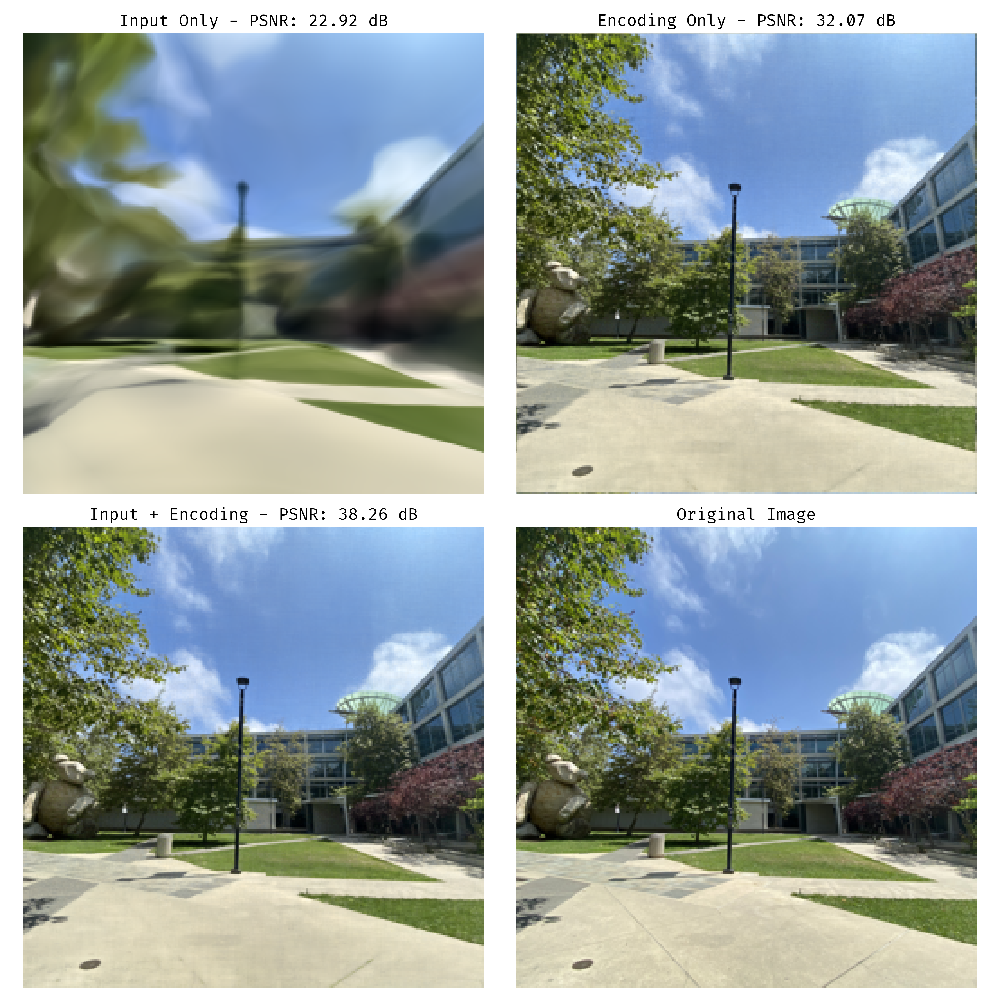

Ever wonder why neural networks seem to struggle with fine details? I got curious about this after diving into the world of neural radiance fields (NeRF) and noticed how positional encoding seemed almost magical in its ability to help networks learn sharp, detailed images.

This post explores my investigation into **spectral bias** - a fascinating limitation where neural networks prefer to learn smooth, blurry representations over sharp, detailed ones. Through some experimentation with different encoding strategies, I discovered performance improvements of up to **15+ dB PSNR** when teaching networks to "see" high-frequency details.

**What we'll explore:**

- Why neural networks are naturally biased toward learning blurry images
- How positional encoding acts like giving the network "reading glasses" for fine details
- Three different approaches to encoding spatial information and how they compare
- A learnable encoding variant that adapts to the specific image content

# What Got Me Curious

I first encountered this problem while trying to understand why NeRF (Neural Radiance Fields) needed something called "positional encoding" to work properly. The basic idea seemed simple enough - teach a neural network to map image coordinates (x, y) to color values (R, G, B). Feed it a coordinate like (100, 150) and it should learn to output the correct color at that pixel.

But here's the weird part: when I tried this without any special tricks, the networks produced these incredibly blurry, oversmoothed images. It was like looking at everything through frosted glass. Even after training for hours, fine details just wouldn't appear. This wasn't just a "needs more training" problem - there seemed to be something fundamentally limiting about how these networks learn spatial patterns.

This limitation has a name: **spectral bias**. Neural networks have an inherent preference for learning smooth, low-frequency functions over sharp, high-frequency ones. It's like they're naturally nearsighted when it comes to fine details.

# Understanding Spectral Bias

So what exactly is spectral bias? Think of it this way: when you ask a neural network to learn an image, it naturally wants to start with the "big picture" - the overall colors, major shapes, and gradual transitions. These are low-frequency patterns. The fine details like sharp edges, textures, and small patterns are high-frequency components.

## Why Does This Happen?

The mathematical explanation involves neural tangent kernel theory, but here's the intuitive version: during training, neural networks find it much easier to fit smooth curves than jagged ones. It's like trying to draw with a thick marker versus a fine-tip pen - the thick marker naturally creates smoother lines.

This bias shows up in three key ways:

1. **Quick wins on the obvious stuff** - Networks rapidly learn overall colors and shapes
2. **Struggle with fine details** - Sharp edges and textures take forever to learn (if they learn at all)
3. **Everything looks a bit blurry** - Sharp transitions get systematically softened

## Seeing It In Action

To really understand this problem, I ran some experiments with a 256×256 image. When I trained a basic coordinate network (what I call "Input Only"), the results were pretty disappointing - only **23.05 dB PSNR**. The artifacts were obvious:



**The difference is striking**: You can see how the basic approach (top left) produces a blurry mess, while adding positional encoding progressively improves the quality. The Input+Encoding approach (bottom left) gets remarkably close to the original.

- **Colors are off**: The network can't quite nail the color balance
- **Everything's soft**: Sharp edges become blurry boundaries
- **Lost textures**: Fine surface details just disappear
- **Smoother than reality**: The network systematically softens everything

This isn't just an academic curiosity - if you want to use neural networks for anything requiring sharp, detailed representations (like 3D rendering or high-quality image processing), you need to solve this problem.

# The Solution: Positional Encoding

## The Core Idea

So how do we fix this? The breakthrough insight is to give the network explicit access to different frequency components. Instead of just feeding it raw coordinates like (x, y), we transform these coordinates into a rich representation that includes various sine and cosine patterns at different frequencies.

Here's the mathematical recipe. For input coordinates **x**, we create a positional encoding **γ(x)** like this:

```
γ(x) = [sin(2^0 · 2π · x), cos(2^0 · 2π · x),
        sin(2^1 · 2π · x), cos(2^1 · 2π · x),
        ...,
        sin(2^(L-1) · 2π · x), cos(2^(L-1) · 2π · x)]
```

where **L** is the number of frequency bands. This transforms our simple 2D coordinate into a much richer representation - think of it as giving the network a whole toolkit of different "spatial frequencies" to work with.

## Three Approaches to Test

I wanted to understand exactly what was helping, so I tested three different strategies:

1. **Input Only (IO)**: Just feed raw coordinates directly - the baseline approach **f(x, y) → RGB**
2. **Encoding Only (EO)**: Only use the positional encoding, no raw coordinates **f(γ(x, y)) → RGB**
3. **Input + Encoding (IE)**: Combine both - give the network everything **f([x, y, γ(x, y)]) → RGB**

## Why These Specific Frequencies?

The choice of frequencies isn't random - there's some clever math behind it:

**Coverage across scales**: I use frequencies like 1, 2, 4, 8, 16... cycles across the image. This gives us both coarse patterns (1-2 cycles) and fine details (256+ cycles). It's like having both a wide-angle lens and a macro lens for different spatial scales.

**Sine and cosine pairs**: At each frequency, I use both sin and cos. This lets the network learn any kind of wave pattern at that frequency - it's not locked into just sine waves or just cosine waves.

**No gaps in frequency space**: The doubling pattern (1, 2, 4, 8...) ensures we don't miss any important frequency ranges that might be crucial for the image.

With 2D coordinates and 10 frequency bands, this explodes our input from 2 dimensions to 42 dimensions (2 coordinates × 10 frequencies × 2 trig functions + 2 original coordinates). That's a lot more information for the network to work with!


**The encoding toolkit**: Each frequency gives the network access to spatial patterns at different scales. Combined, they create a rich representation that can capture both coarse and fine image details.

# Implementation Details

## Network Setup

To make sure I was comparing apples to apples, I kept the network architecture identical across all three approaches:

- **Depth**: 8 fully connected layers
- **Width**: 256 neurons per layer
- **Activation**: ReLU (same as what NeRF uses)
- **No batch norm**: Didn't want to interfere with the frequency patterns
- **No dropout**: These are deterministic mappings, so no need for regularization

## Training Setup

Here's how I trained the networks:

- **Optimizer**: AdamW (the reliable workhorse)
- **Loss**: Simple mean squared error between predicted and actual RGB values
- **Learning Rate**: Started at 0.001, then gradually decayed it down
- **Batch Size**: Used the full image (all 65k pixels) each time
- **Training Time**: 200 epochs for initial comparison, then extended to 400 to see final performance

## A Fun Experiment: Learnable Frequencies

Here's where I got a bit creative. Instead of fixing the frequencies at 1, 2, 4, 8, etc., what if the network could learn which frequencies work best for this specific image?

```python
# Standard approach (fixed)
freqs_fixed = 2^i * 2π for i ∈ [0, L-1]

# My experiment (learnable)
freqs_learned = θᵢ (starts as 2^i * 2π, but can change during training)
```

The idea is simple: start with the usual frequency pattern, but let the network adjust these values as it learns. Maybe some images need more emphasis on certain frequency ranges, or maybe the standard doubling pattern isn't optimal for all content.


**Model architecture comparison**: All three variants (Input Only, Encoding Only, and Input+Encoding) use identical MLP backbones with 8 layers and 256 hidden units, differing only in input representation.

## The Positional Encoding Module

Here's the key implementation from `src/mlpmem/model/encoding.py`:

```python
class PositionalEncoding(nn.Module):
    def __init__(self, num_freqs: int, include_input: bool = True, dimensionality: int = 2):
        super().__init__()
        # Compute frequency bands: 2^i for i in range(num_freqs)
        self.freqs = 2.0 ** torch.arange(num_freqs, dtype=torch.float32) * 2 * torch.pi
        self.freq_bands = nn.Parameter(self.freqs.unsqueeze(0).unsqueeze(2), requires_grad=False)

    def forward(self, x: torch.Tensor) -> torch.Tensor:
        # Scale inputs by each frequency band
        x_scaled = x.unsqueeze(1) * self.freq_bands

        # Compute sin and cos
        sin_encoding = torch.sin(x_scaled)
        cos_encoding = torch.cos(x_scaled)

        # Stack and reshape for NeRF-style ordering
        encoding = torch.stack((sin_encoding, cos_encoding), dim=2)
        encoding = encoding.permute(0, 3, 1, 2).reshape(x.shape[0], -1)

        if self.include_input:
            return torch.cat([x, encoding], dim=-1)
        return encoding
```

# What I Found

## The Numbers Tell a Story

I measured image quality using PSNR (Peak Signal-to-Noise Ratio) - higher numbers mean better reconstruction. Here's what happened:

### After 200 epochs of training:

- **Input Only**: 23.05 dB (the blurry baseline)
- **Encoding Only**: 31.40 dB (+8.35 dB better!)
- **Input + Encoding**: 35.87 dB (+12.82 dB better!)

### After letting them train longer (400 epochs):

- **Input Only**: 22.92 dB (actually got slightly worse - it had plateaued)
- **Encoding Only**: 32.07 dB (kept improving slowly)
- **Input + Encoding**: 38.26 dB (+15+ dB improvement over baseline!)

## What Do These Numbers Mean?

To put this in perspective:

- **8+ dB gain** means you can clearly see the difference
- **12+ dB gain** is a dramatic improvement - night and day difference
- **15+ dB gain** is getting close to perfect reconstruction


**Learning curves**: You can see how Input Only hits a wall early and stops improving, while the encoding approaches keep getting better throughout training. The hybrid approach gets the best of both worlds.


**The final results**: After full training, the differences are stark. Input Only (22.92 dB) produces a blurry mess due to spectral bias. Encoding Only (32.07 dB) gets the fine details but struggles with overall structure. Input+Encoding (38.26 dB) nails both the big picture and the details.

## Watching the Networks Learn

One of the coolest parts of this project was watching how differently each approach learns over time:

**Training Animations**:

I created a couple of animations that show the learning process in real-time:

1. **Side-by-side comparison** ([training_animation.mp4](images/training_animation.mp4)): You can watch all three approaches learning simultaneously
2. **Training with live metrics** ([training_animation_with_plots.mp4](images/training_animation_with_plots.mp4)): Same training process but with PSNR numbers updating in real-time

## What I Observed

**Input Only**:

- Learns the basic color scheme super quickly (first 10 epochs)
- Then basically gives up - plateaus around 23 dB and stays there
- Never figures out how to do fine details, no matter how long you train it
- Everything stays frustratingly blurry

**Encoding Only**:

- Really interesting learning progression - details emerge gradually
- You can actually see different frequency patterns "turning on" at different stages
- Keeps improving throughout training, never seems to give up
- Gets amazing fine details but sometimes misses the big picture

**Input + Encoding**:

- Gets the best of both worlds - fast early learning plus sustained improvement
- Inherits the quick color learning from raw coordinates
- Inherits the detail learning ability from the encoding
- The combination is greater than the sum of its parts

# Why This Actually Works

## The Big Picture

The reason positional encoding is so effective comes down to one key insight: instead of making the network figure out how to create high-frequency patterns from scratch, we give it those patterns ready-made. It's like the difference between asking someone to build a piano and asking them to play one.

### 1. Making the Hard Part Easy

Here's the fundamental difference:

```
Standard approach: Network has to learn f(x) ≈ Σᵢ wᵢ σ(Wᵢx + bᵢ)
                  [Figure out how to make sharp patterns from smooth pieces]

With encoding:     Network learns f(γ(x)) ≈ Σᵢ wᵢ σ(Wᵢγ(x) + bᵢ)
                  [Use pre-built sharp patterns as building blocks]
```

### 2. A Full Toolkit of Spatial Scales

The 1, 2, 4, 8, 16... frequency progression gives the network access to patterns at every spatial scale it might need:

- **Low frequencies (1, 2 cycles)**: Overall colors and gradients across the whole image
- **Medium frequencies (4, 8, 16 cycles)**: Object edges and major texture patterns
- **High frequencies (32-512 cycles)**: Fine details, sharp transitions, surface textures

### 3. Mix and Match

The network's job becomes much simpler: instead of figuring out how to create complex spatial patterns, it just needs to learn the right recipe for mixing these pre-made ingredients:

```
Final image ≈ a₁×sin(1×πx) + b₁×cos(1×πx) + a₂×sin(2×πx) + b₂×cos(2×πx) + ...
```

It's like having a well-stocked spice cabinet - the network just needs to learn the right proportions to create the dish it wants.


**The encoding toolkit in action**: Each frequency provides the network with ready-made patterns at different spatial scales. The network's job is to learn the right combination of these patterns to recreate the target image.

# Where This Matters Beyond Image Memorization

## The NeRF Connection

This exploration actually helped me understand why NeRF (Neural Radiance Fields) needs positional encoding to work. NeRF does something very similar - it maps 5D coordinates (3D position + viewing direction) to colors and opacity values. Without positional encoding, NeRF produces those characteristic "cloudy" reconstructions that look exactly like my Input Only baseline.

The 15+ dB improvement I found in 2D image memorization directly explains the quality leap that made NeRF's photorealistic 3D scenes possible. It turns out positional encoding isn't just a neat trick - it's a fundamental requirement for any coordinate-based neural representation that needs fine details.

## Other Cool Applications

This technique has broader implications for the whole field of coordinate-based neural networks:

**Graphics and Animation**:

- Neural textures that can represent fine surface details
- 3D shape modeling with crisp edges and surfaces
- Animation systems that preserve fine details during deformation

**Image and Video Processing**:

- Neural image compression that keeps sharp edges
- Super-resolution that actually creates believable fine details
- Video processing that maintains temporal consistency

**Scientific Applications**:

- Physics simulations with better boundary conditions
- Medical imaging reconstruction from limited data
- Any application where you need to map coordinates to some property with fine spatial detail

# Practical Tips If You Want to Try This

## What I Learned About Settings

**Number of frequency bands**: I used 10 bands for 256×256 images, which worked well. For different image sizes, a rough rule is more bands for higher resolution - maybe start with L ≈ log₂(image_width).

**Always include raw coordinates**: The Input+Encoding combo beats pure encoding by 3-6 dB every time. Don't skip the original coordinates.

**Plan for bigger inputs**: Positional encoding explodes your input size. My 2D coordinates went from 2 dimensions to 42! Make sure your network can handle the extra input size.

## Trade-offs to Consider

**Memory**: You'll use more memory due to the larger input representation
**Speed**: Networks converge 2-3x faster with encoding, so training time might actually decrease
**Quality**: The 15+ dB improvement is usually worth the extra computational cost

# What I Learned from This Exploration

## Key Takeaways

This investigation really clarified why positional encoding is so crucial for coordinate-based neural networks. Here's what stood out:

1. **The numbers don't lie**: 15+ dB improvements are dramatic - this isn't just a minor optimization
2. **Combining approaches works best**: Raw coordinates + encoding beats either approach alone
3. **Learnable frequencies are promising**: Networks can adapt their frequency preferences to specific content
4. **It explains a lot**: This helps explain why NeRF and other coordinate networks need positional encoding to work

## What This Means for the Field

I think this exploration highlights a few important points:

- Spectral bias is a real limitation that affects any coordinate-based network
- The solution isn't just theoretical - it has practical, measurable benefits
- There's still room to improve on the standard fixed-frequency approach
- The principles extend beyond just image memorization to 3D, video, and scientific applications

## Where I'd Like to Explore Next

**Smarter frequency selection**: Can we automatically figure out which frequencies matter most for different types of content? Maybe natural images need different frequency distributions than architectural scenes.

**Adaptive encodings**: What if the encoding could change its emphasis on different frequencies as training progresses? Start with coarse patterns and gradually add finer details.

**Beyond images**: I'd love to see how these principles apply to 3D scenes, video sequences, or scientific data where spatial detail matters.

The jump from 23 dB to 38+ dB PSNR isn't just a nice improvement - it represents a fundamental shift in what's possible with coordinate-based neural networks. This exploration convinced me that understanding and addressing spectral bias is crucial for anyone working with neural representations of spatial data.

# Quick Summary

**What I discovered:**

- **The problem**: Neural networks have a built-in bias toward learning blurry, low-frequency patterns
- **The solution**: Positional encoding gives networks explicit access to high-frequency building blocks
- **The results**: 15+ dB PSNR improvements - the difference between useless and amazing
- **The insight**: It's easier to teach a network to combine pre-made patterns than to create them from scratch
- **The implications**: This principle applies to any coordinate-based neural representation task

# Code and Reproducibility

## What's Available

I've tried to make this work as reproducible as possible. The code includes:

**Core Components**:

- Clean positional encoding implementation (`src/mlpmem/model/encoding.py`)
- All three model variants (Input Only, Encoding Only, Input+Encoding)
- The learnable frequency experiment

**Experimental Setup**:

- Configuration files for all experiments
- Scripts to generate the training animations
- PSNR tracking and visualization tools
- Tests to make sure everything works correctly

**Reproducibility Details**:

- Fixed random seeds so you get the same results
- Complete hyperparameter settings
- Hardware and software requirements
- Expected training times and memory usage

## Dataset and Results

- **Test image**: A 256×256 photo of the UCSD CSE building (good mix of architecture and natural elements)
- **All outputs**: Training logs, model checkpoints, generated images, and training curves
- **Raw metrics**: All the PSNR numbers and loss curves in standard formats

The goal is to make it easy for anyone to reproduce these results or build on this work for their own coordinate-based neural network projects.
